# Science Fiction Quiz Game
##### Code Institute / Interactive Frontend Development

You can check the website here [Science Fiction Quiz](https://devancadman.github.io/MP2-Science-Fiction-Quiz)

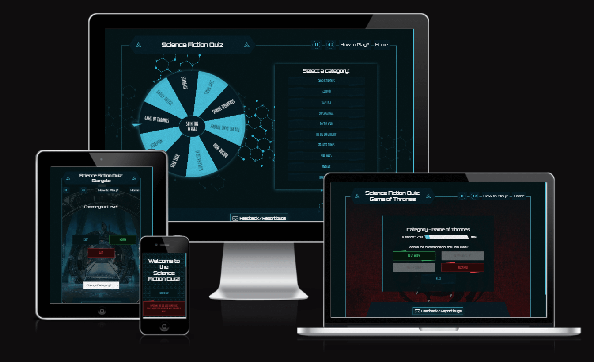

(Developer: Devan Cadman)

Welcome to the Science Fiction (TV Series & Movies) Quiz! This JavaScript-based game offers a responsive and engaging experience for casual online gamers. Test your knowledge and have fun with this three-page quiz site dedicated to science fiction enthusiasts.

___

## Table of Contents

- [Science Fiction Quiz Game](#quiz-game)
  - [Table of Contents](#table-of-contents)
  - [Project Goals](#project-goals)
    - [Player Goals](#player-goals)
    - [Site Owner Goals](#site-owner-goals)
  - [User Experience](#user-experience)
    - [Target Audience](#target-audience)
    - [User Requirements and Expectations](#user-requirements-and-expectations)
    - [User Stories](#user-stories)
      - [Players](#players)
      - [Site Owner](#site-owner)
  - [Design](#design)
    - [Design Choices](#design-choices)
    - [Colours](#colours)
      - [User Interface](#user-interface)
    - [Fonts](#fonts)
    - [Structure](#structure)
    - [Common sections](common-sections)
    - [Wireframes](#wireframes)
  - [Technologies Used](#technologies-used)
    - [Languages](#languages)
    - [Frameworks \& Tools](#frameworks--tools)
  - [Features](#features)
    - [Existing Features](#existing-features)
    - [Future Features](#future-features)
  - [Testing](#testing)
    - [HTML Validation](#html-validation)
    - [CSS Validation](#css-validation)
    - [JavaScript Validation](#javascript-validation)
    - [Accessibility](#accessibility)
    - [Performance](#performance)
    - [Compatibility Testing](#compatibility-testing)
    - [Browser compatibility](#browser-compatibility)
    - [Device compatibility and Responsiveness](#device-compatibility-and-responsiveness)
      - [Testing](#testing)
      - [Tested Devices](#tested-devices)
    - [Testing user stories](#testing-user-stories)
      - [Players](#players-1)
      - [Site Owner](#site-owner-1)
      - [User Story Video](#user-story-video)
  - [Bugs](#bugs)
  - [Deployment](#deployment)
  - [Credits](#credits)
    - [Code](#code)
    - [Icon References/Attributes](#icon-reference-attributes)
    - [Image References/Attributes](#image-reference-attributes)
    - [Audio References](#audio-reference)
  - [Acknowledgements](#acknowledgements)

___

## Project Goals

The goals of this website include:

### Player Goals

- Play a fun and interactive online quiz game.
- Quickly understand how to play.
- Test their knowledge of Science Fiction TV series and Movies.
- Challenge themselves by answering a series of quiz questions.
- Play the game as often as desired with a easy "play again" option.
- Learn interesting facts and trivia about Science Fiction.

### Site Owner Goals

- Create a fun interactive game that furthers my understanding of problem solving, through the use of code. From HTML, CCS to the JavaScript language.
- Create an attractive and easy to use website and user interface.
- Create a fully responsive game website.

[Back to Table of Contents](#table-of-contents)

___

## User Experience

### Target Audience

- The Science Fiction Quiz is perfect for science fiction enthusiasts, whether you're a self-proclaimed nerd, geek, or simply someone with a passion for this genre. If you're a brainiac who craves exciting quiz challenges, this game is tailored for you. It's also an ideal choice for those who enjoy playing online quiz games. All you need is a web browser with JavaScript enabled on your device to embark on this thrilling journey of knowledge and entertainment.

### User Requirements and Expectations

- An intuitive navigation system regardless of screen size
- Easy to locate and understand game rules and instructions on how to play the game
- An intuitive game interface with clear controls and notifications to aid game play
- The ability to turn game Sound effects or Music on or off
- An easy way to provide the developer with feedback on the game
- An easy mechanism to Play Again.
- A simple way to change the category, after selecting one.
- An accessible game website that can be viewed and played on any device

[Back to Table of Contents](#table-of-contents)

___

### User Stories

The players of the game are the primary users of this website with site owner being a secondary user:

#### Players

1.	As a player, I want the website to load quickly and provide a seamless and enjoyable quiz experience without any technical issues.
2.	As a player, I want to have a visually appealing and intuitive interface that makes it easy for me to understand and interact with the quiz.
3.	As a player, I want to be able to select a specific category, such as "Game of Thrones" or "Star Wars," to play a quiz tailored to my interests.
4.	As a player, when I navigate to different game categories, I want the category theme to be a seamless transition to match the new category, creating a smooth and cohesive environment. This includes category-themed background images and background music.
5.	As a player, I want the quiz questions to be challenging and engaging, providing a variety of question types and difficulty levels.
6.	As a player, I want to see my score and the number of correct answers at the end of the quiz to assess my performance.
7.	As a player, I want to be able to see the correct answers for the questions I answered incorrectly to learn and improve my knowledge.
8.	As a quiz player, I want the option to play the quiz again with the same category or choose a different category to explore different topics.
9.	As a player, I want to be able to easily navigate back to the home page or explore other sections of the website after completing the quiz.
10.	As a player, I want the game to have smooth and fluid animations and transitions, enhancing the overall visual appeal and user experience.
11.	As a player, I want the game to be optimized for different screen sizes and orientations, ensuring a seamless and enjoyable experience on both mobile and desktop devices.
12.	As a player, I want the game to have a visually appealing and intuitive user interface, with clear icons and labels, to easily understand and interact with the game controls.
13.	As a player, when I interact with buttons or elements in the game interface, I want to hear appropriate sound effects, such as button clicks or hover sounds. These sound effects will provide feedback and create a more engaging and responsive user experience.
14.	As a player, I want the sound effects to be enjoyable, non-intrusive, and harmonize with the overall game aesthetics, ensuring they enhance the gameplay experience without becoming distracting or annoying.
15.	As a science fiction enthusiast, I want to be able to play a Science Fiction Quiz to test my knowledge and have fun.
16.	As a player, I want the game to have a progress bar or indicator to track my progress during the quiz.

#### Site Owner

17. As the site owner, I want to receive feedback from players so I can understand if they are enjoying the game, identify any bugs, and continually improve the game.
18. As the site owner, I want users to see a 404 page if they enter an incorrect URL so they can be navigated back to the main game page.

[Back to Table of Contents](#table-of-contents)

___

## Design

### Design Choices

The aim of this site is to provide the look and feel of a Futuristic style web application. With its blue hexagon and neon theme. All images, colours, and sounds were chosen with this aim in mind.

### Colours

The colour scheme for the game was based around Futuristic Blue colours, mixed with neon red & green as supplementary colours:

#### User Interface

Primary Colours - Light Blue / Blue / Navy

 

Secondary Colours - Red / dark Red / Green / Dark Green / White

 

Colour contrast compliance was tested using [WebAIM's Contrast Checker tool](https://webaim.org/resources/contrastchecker/).
[Check out the Results here.](./docs/documentation-images/colour-contrast)

### Fonts

[Orbitron](https://fonts.google.com/specimen/Orbitron) font was selected from Google fonts to give the site a more futuristic style.
This is used on the Logo, Navigation, Footer, headings and the body.With Monospace, used as a fallback font.
 

[Breamcatcher](https://www.cdnfonts.com/breamcatcher.font) font was used for the Buttons, li, select and input fields.
As a fallback, Lucida Sans Typewriter, Helvetica, sans-serif fonts were added.
 

On the 404 Error page, I used the Monospace font for the header and paragraph sections.

Fonts are imported using the Google Fonts library & CDN.

### Structure

The website consists of four/five pages (welcome overlay screen/page, home page, level page, quiz page, 404 error page).
The pages are structured in an easy-to-navigate framed pattern allowing visitors to quickly consume key information within the center of the screen. Starting at the top left of the page the visitor will notice the quiz game logo, then followed on the right side by the navigation menu. This includes Sound & Music toggle buttons, How to Play modal button and a home button.
This allows the user to quickly understand the name of the game, return to the home page, how to play, and how to toggle sound/music on or off.

#### Common sections:

- A Custom Logo in the header, which links to the home page.
  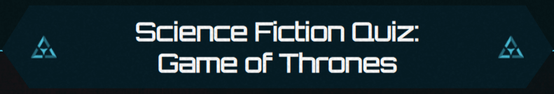
- A navigation bar to the right this contains:
  - Music play/pause toggle icon.
  - Sound mute/unmute toggle icon.
  - A How to Play modal which conveys the rules of the game and how to play.
  - Home button.
  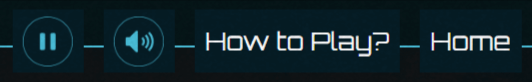
- A footer section which displays:
  - Feedback / Report Bugs Contact Modal Button.
  - The site copywrite notice.
  - Link to the creators Github Page.
  - As this was an educational project, it has a link to the Education Institution.
  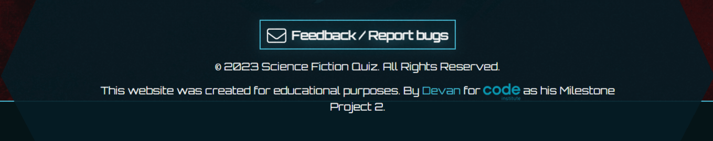

#### Welcome Overlay Screen/Page

- An Overlay screen, with a background consisting of the site logo triangle icon, in a repeated pattern.

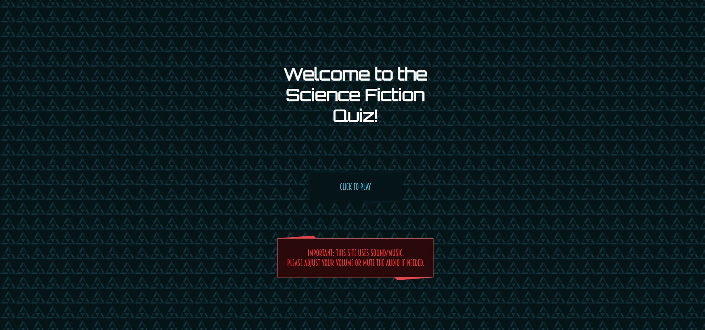

#### Home Page

- The site consist's of the categories to be selected. These are provided in 2 ways a Listed format and in a Randomly chosen format via a spin the wheel animation.

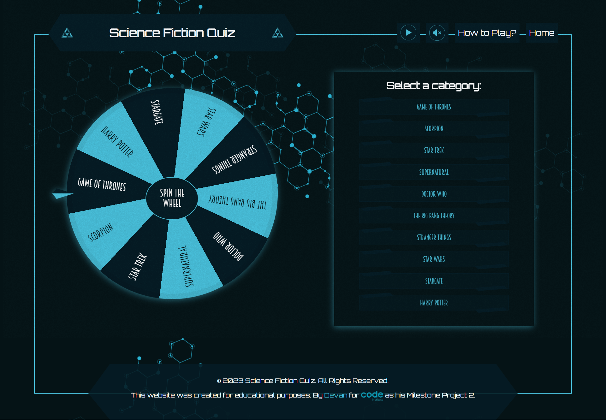

#### Level Page

- A simple level selection page, allowing the user to choose from, Easy, Medium or Hard Levels.
A drop-down button has been added below this, to allow the user to quickly change the quiz Category.

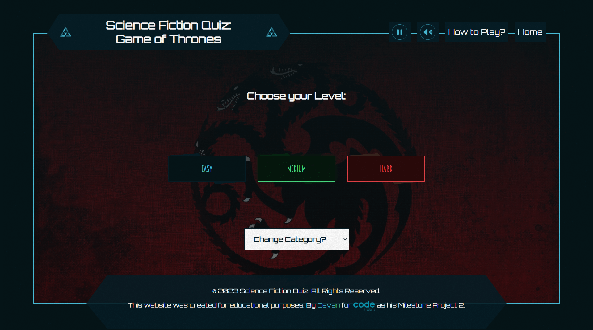

#### Quiz Page

- Showcasing the Category specific questions. This page show's the question number, as well as the max questions, and a progression bar. The user is instantly show wether the question answer they selected was correct or wrong.
Upon finishing the quiz, the user is shown their total score and a list of the answered questions with answers. These are provided in the answered style or wrong or correct, depending how the user chose.
Below this is a button to "Play Again!".

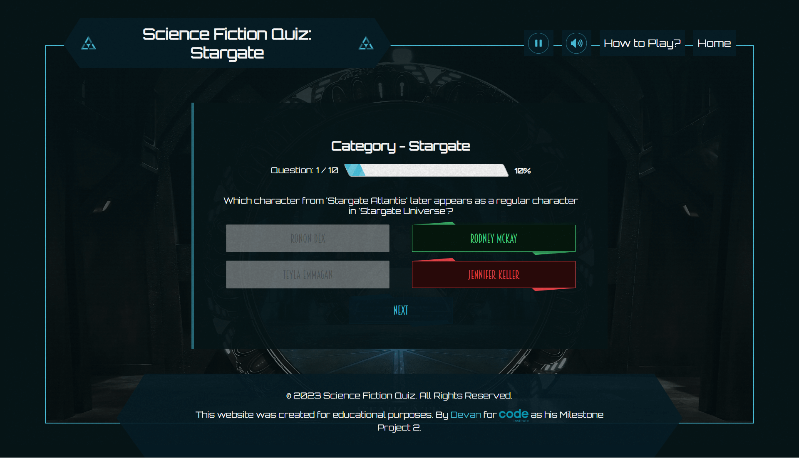
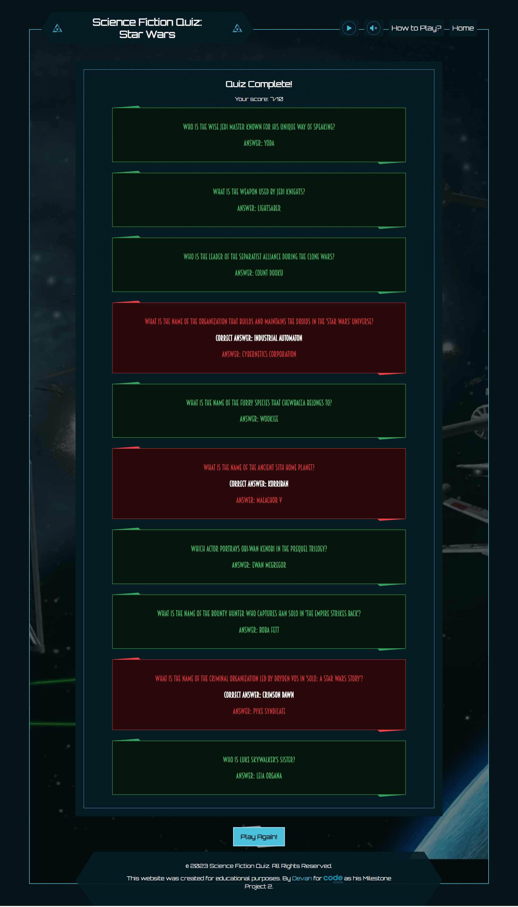

#### 404 Page

- A 404 page not found message page. This lets the user know they have entered an incorrect URL and provides them with a "Return Home!" button to navigate back to the quiz game index page.
It showcases a typing animated header, which has rotating content. Below this is a large message area and then the Return home button.

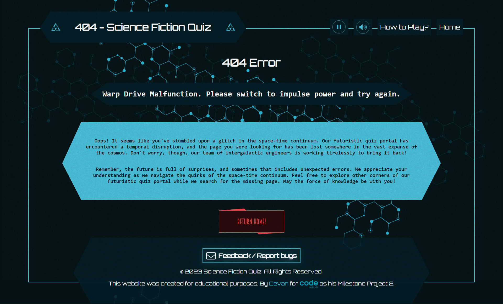

#### How to Play

- A simple modal, with a list on how to play the game in detail.

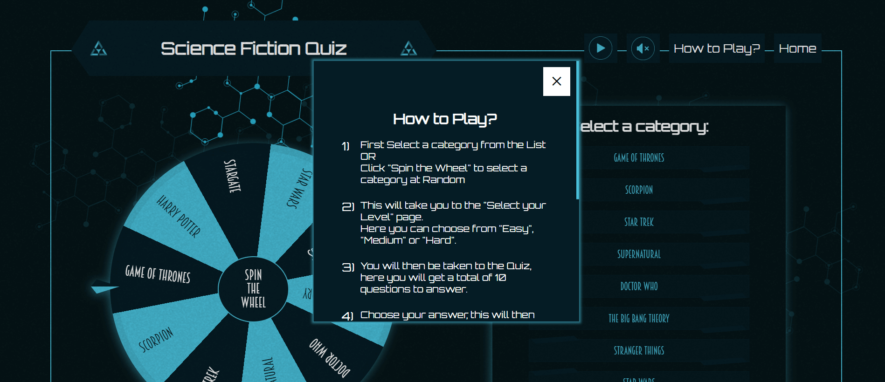

#### Get in Touch

- A Feedback / Report Bugs or just get in touch popup modal Form. This allows the user to enter their name, email and a message. Upon Completion they will be shown a Thank You message.

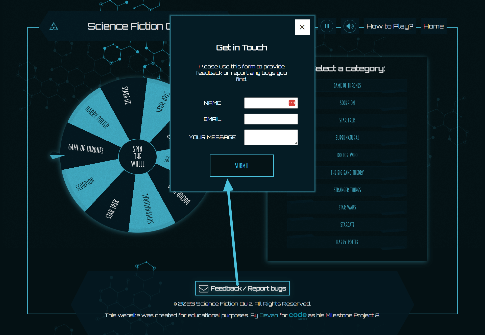

### Wireframes

[Desktop Wireframe](./docs/wireframes/desktop/science-fiction-quiz-wireframe-desktop.xd)
[Mobile Wireframe](./docs/wireframes/mobile/science-fiction-quiz-wireframe-mobile.xd)

#### Welcome Overlay Screen/Page

Mobile

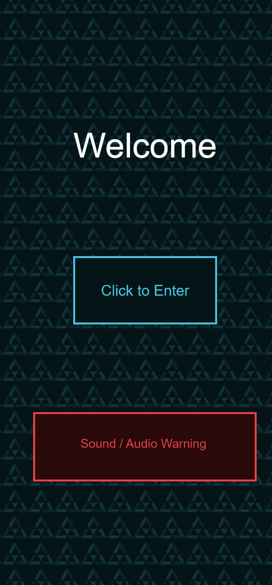

Desktop

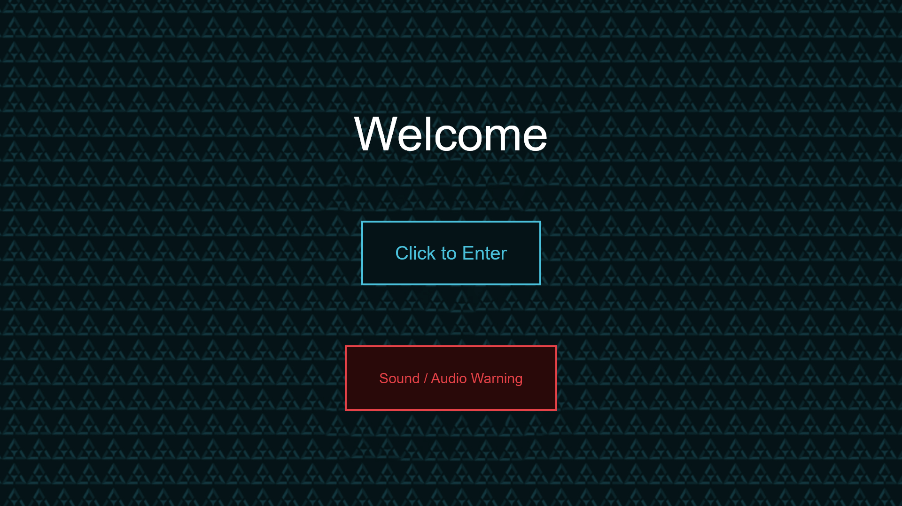

#### Home Page

Mobile

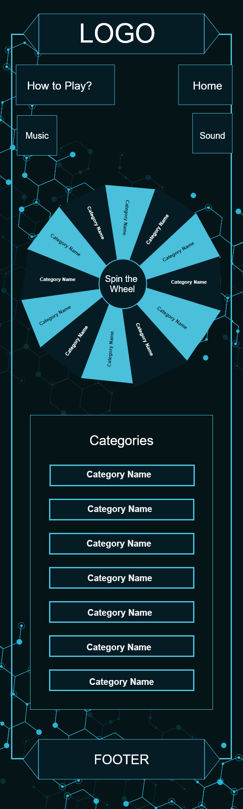

Desktop

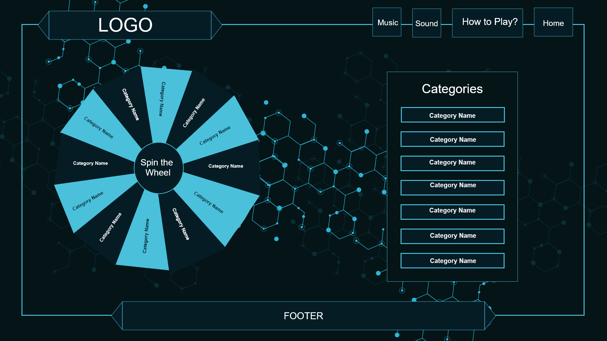

#### Level Page

Mobile

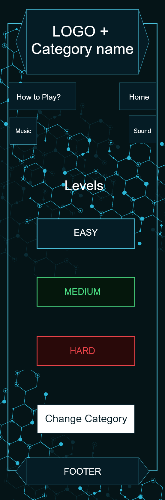

Desktop

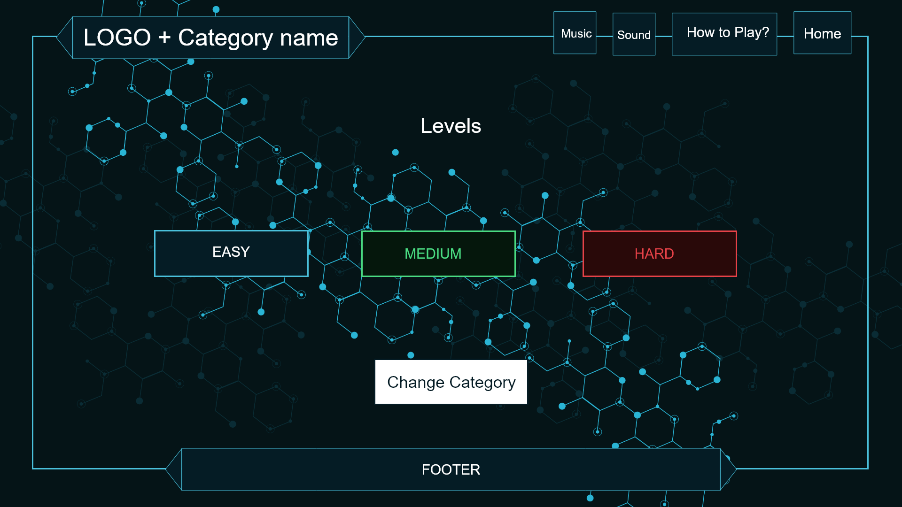

#### Quiz Page

Mobile

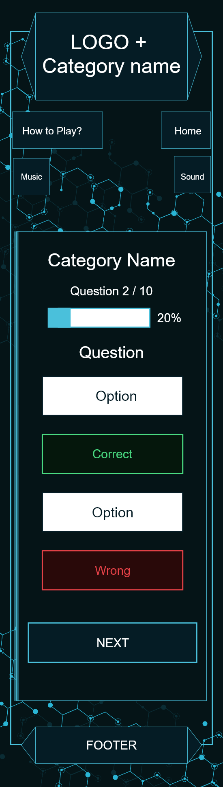

Desktop

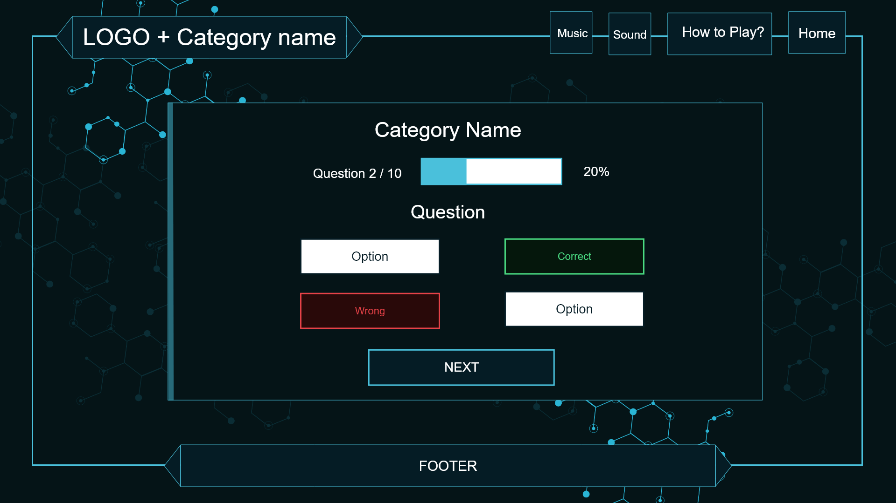
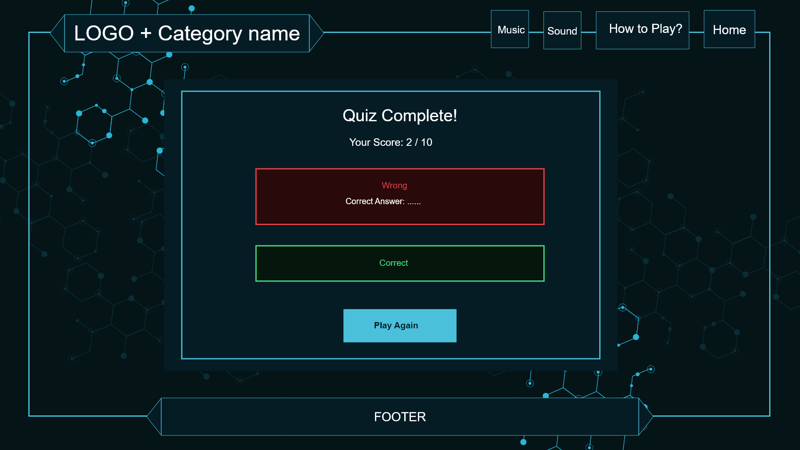

### 404 Page

Mobile

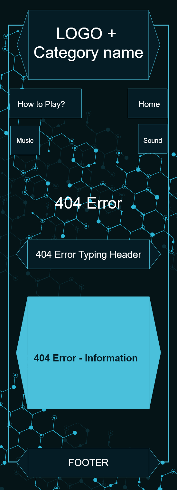

Desktop

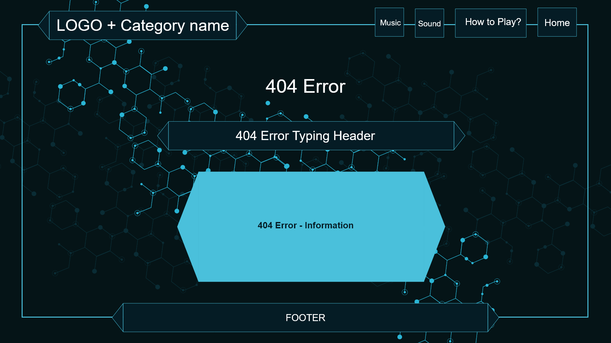

[Back to Table of Contents](#table-of-contents)

## Technologies Used

### Languages

- HTML
- CSS
- JavaScript

### Frameworks & Tools

*  [HTML5](https://developer.mozilla.org/en-US/docs/Glossary/HTML5) - building, structuring and presenting project
*  [CSS3](https://developer.mozilla.org/en-US/docs/Web/CSS) - website styling
*  [JavaScript](https://developer.mozilla.org/en-US/docs/Web/JavaScript) - building, structuring and presenting project

*  [Adobe Illustrator](https://www.adobe.com/uk/products/illustrator.html) - To create site icons.
*  [Adobe Photoshop](https://www.adobe.com/uk/products/photoshop.html) - To edit photos.
*  [Adobe XD](https://www.adobe.com/products/xd/learn/get-started/what-is-adobe-xd-used-for.html) - To create Wireframes.

*  [ChatGPT by OpenAI - for code validation, formatting, & content suggestions](https://chat.openai.com/)
*  [VScode](https://code.visualstudio.com) - code editing
*  [GIT](https://git-scm.com/), [GitHub](https://github.com/) - tracking, storing, hosting project
*  [GitHub Desktop](https://desktop.github.com/) - for local development

* [JSHint JavaScript Validation Tool](https://jshint.com/)
* [W3C Markup Validation Service](https://validator.w3.org/)
* [W3C CSS Validation Service](https://jigsaw.w3.org/css-validator/)
* [WAVE web accessibility evaluation tool](https://wave.webaim.org/)
* [Google Lighthouse](https://developer.chrome.com/docs/lighthouse/overview/)

* [Favicon.io - Favicon generator](https://favicon.io/)
*  [Google Fonts:](https://fonts.google.com/) - Google fonts were used to import the 'Orbitron' font into the style.css file which is used on all pages throughout the project.
* [Font Awesome](https://fontawesome.com/) - To create the envelope icon, for the contact button.
* [Coolors](https://coolors.co/) - Coolors was used for choosing the website's colours palette.
* [Shrink.media](https://www.shrink.media/) - To shrink images.
* [Tiny PNG](https://tinypng.com/) - To compress images.
* [Convertfiles.ai](https://www.convertfiles.ai/) - To convert images.
* [Tiny IMG](https://tiny-img.com/webp/) - To convert images to webp.
* [FreeConvert](https://www.freeconvert.com/) - To Compress the Audio MP3's and the User Stories video MP4.
*  [Shields.io](https://shields.io/) - To add badges to the README

*  [Chrome DevTools](https://developer.chrome.com/docs/devtools) -  - To troubleshoot and test features, solve issues with responsiveness and styling.
* [Am I Responsive?](http://ami.responsivedesign.is/) &  [Responsinator](http://www.responsinator.com/) - To show the website image on a range of devices.
* [BrowserStack](https://www.browserstack.com/guide/browser-compatibility-for-variable-fonts) - To check site responsiveness on live devices.
* [Polypane Browser](https://polypane.app/) - Responsive & Accessibility Testing and more!
* [ghostCSS](http://wernull.com/2013/04/debug-ghost-css-elements-causing-unwanted-scrolling/) - To check for layout issues.
* [Can I Use](https://caniuse.com/#home) - to check for CSS Browser comparability issues.
* [Deadlinkchecker](https://www.deadlinkchecker.com/) - To check site for Dead Links.

[Back to Table of Contents](#table-of-contents)

___

## Features

The website consists of four/five pages (welcome overlay screen/page, home page, level page, quiz page, 404 error page). This site contains a total of 15 features.

### Existing Features

#### Quiz Questions (User Story 15):

- Provide a set of science fiction-related quiz questions for the players to answer.
- Explanation: This feature is essential for the main functionality of the quiz, allowing players to test their knowledge of science fiction.

#### Multiple Choice Options (User Story 5):

- Each quiz question should have multiple choice options for players to select their answer.
- Explanation: Multiple choice options make the quiz interactive and allow players to choose the answer they believe is correct.

#### Correct Answer Validation (User Story 7):

- Validate the player's answer and provide immediate feedback on whether their answer is correct or incorrect.
- Explanation: This feature helps players know if they answered each question correctly, providing an interactive and engaging experience.

#### Score Tracking (User Stories 6, 9):

- Keep track of the player's score throughout the quiz.
- Explanation: This feature allows players to see their progress and compete with themselves or others.

#### Feedback and Improvement (User Story 24):

- Provide a feedback mechanism for players to share their thoughts, report bugs, and suggest improvements. The Form collects a player's name, email address, and feedback message.
- The feedback form connects to the EmailJS service to validate the form fields and email the form data to the developer
- A thank you message is shown on the same page when the form has been submitted
- Explanation: This feature allows players to provide feedback to the quiz creator, helping to improve the quiz experience and fix any issues.

#### Error Handling (User Story 25):

- Implement error handling for incorrect URLs, displaying a 404 page and redirecting users to the main quiz page.
- Explanation: This feature ensures that users are directed to the correct page when they enter an incorrect URL.

#### Difficulty Levels (User Story 8):

- Implement different difficulty levels for the quiz questions, such as easy, medium, and hard.
- Explanation: This feature allows players to choose the level of challenge they prefer and caters to a wider range of knowledge levels.

#### Category Selection (User Story 3):

- Allow players to select specific categories or sub-genres within science fiction for the quiz questions (e.g., space exploration, dystopian worlds, time travel).
- Explanation: This feature adds variety to the quiz and caters to players' specific interests within the science fiction genre.

#### Randomized Question Order (User Story 10):

- Randomize the order of quiz questions each time a player takes the quiz.
- Explanation: This feature prevents players from memorizing the quiz questions' order and encourages repeated play.

#### Progress Bar (User Story 6):

- Display a progress bar indicating the player's advancement within the quiz.
- Explanation: The progress bar gives players a visual representation of their progress and motivates them to complete the entire quiz.

#### Play Again Button (User Story 8):

- Include a "Play Again" button at the end of the quiz to allow players to restart the quiz with a new set of questions.
- Explanation: This feature offers convenience to players who want to replay the quiz without navigating back to the starting point.

#### How to Play Modal (User Story 2):

- Display a modal or pop-up window that provides instructions on how to play the quiz.
- Explanation: This feature helps new players understand the quiz format and rules before they start playing.

#### Change Category on Levels Page (User Story 8):

- Allow players to change the selected category on the levels page before starting the quiz.
- Explanation: This feature provides flexibility for players to switch categories if they change their mind or want to explore different topics within science fiction.

#### Click to Play Overlay Welcome Page (User Story 2):

- Design an overlay welcome page with a "Click to Play" button that mutes music and sounds by default until the user interacts with the site.
- Explanation: This feature creates an immersive experience for users by providing an engaging welcome page with interactive elements and control over audio.

#### Spin the Wheel - Random Category Selector (User Story 8):

- Implement a "Spin the Wheel" feature that randomly selects a category for the quiz questions.
- Explanation: This feature adds an element of surprise and randomness to the quiz, allowing players to explore different categories they might not have chosen themselves.

### Future Features:

#### Leaderboard (Future Feature 1):

- Implement a leaderboard that displays the top scores of players, creating a competitive element and encouraging users to improve their performance.
- Explanation: This feature adds a sense of competition and allows players to compare their scores with others, fostering engagement and motivation.

#### Time-Based Questions and Timer with Scoring (Future Feature 2):

- Include time-based questions that require players to answer within a certain time limit, with scoring based on their speed and accuracy.
- Explanation: This feature adds a time pressure element to the quiz, making it more challenging and engaging for players.

#### Links to Websites for More Information on the Category (Future Feature 3):

- Provide links to external websites or resources related to each category or sub-genre within science fiction, such as Wikipedia pages or relevant articles.
- Explanation: This feature allows players to explore and learn more about the specific topics covered in the quiz, enhancing their knowledge and providing additional context.

#### Achievements and Badges (Future Feature 4):

- Create a system of achievements and badges that players can earn based on their performance in the quiz, completion of specific challenges, or reaching certain milestones.
- Explanation: This feature adds a sense of progression and accomplishment for players, providing incentives for repeated play and engagement.

[Back to Table of Contents](#table-of-contents)

___

## Testing

### HTML Validation

The W3C Markup Validation Service was used to validate the HTML of the website. All pages pass with no errors and no warnings shown.

- index.html [results](https://validator.w3.org/nu/?doc=https%3A%2F%2Fdevancadman.github.io%2FMP2-Science-Fiction-Quiz%2Findex.html)
- level.html [results](https://validator.w3.org/nu/?doc=https%3A%2F%2Fdevancadman.github.io%2FMP2-Science-Fiction-Quiz%2Flevel.html)
- quiz.html [results](https://validator.w3.org/nu/?doc=https%3A%2F%2Fdevancadman.github.io%2FMP2-Science-Fiction-Quiz%2Fquiz.html)
- 404.html [results](https://validator.w3.org/nu/?doc=https%3A%2F%2Fdevancadman.github.io%2FMP2-Science-Fiction-Quiz%2F404.html)

[View Screenshots here.](./docs/documentation-images/Validation/html-validation)

### CSS Validation

The W3C Jigsaw CSS Validation Service was used to validate the CSS of the website.

- styles.css [results](https://jigsaw.w3.org/css-validator/validator?uri=https%3A%2F%2Fdevancadman.github.io%2FMP2-Science-Fiction-Quiz%2F&profile=css3svg&usermedium=all&warning=1&vextwarning=&lang=en)

[View Screenshots here.](./docs/documentation-images/testing/css-validation)

### JavaScript Validation

The JS Hint JavaScript Validation Service was used to validate the JavaScript code on the website. The results below show three code warnings related to "Functions declared within loops referencing an outer scoped variable may lead to confusing semantics". Or undeclared Variables as these are dynamic variables or are declared in the main script.js file or relate to the EmailJS. I'm flagging these for future improvement:

#### script.js
**Metrics**
There are 24 functions in this file.
Function with the largest signature take 3 arguments, while the median is 0.
Largest function has 38 statements in it, while the median is 4.
The most complex function has a cyclomatic complexity value of 11 while the median is 1.

**Two warnings:**
98	Functions declared within loops referencing an outer scoped variable may lead to confusing semantics. (buttons, i)
308	Function declarations should not be placed in blocks. Use a function expression or move the statement to the top of the outer function.

#### spin-wheel.js
**Metrics**
There are 16 functions in this file.
Function with the largest signature take 2 arguments, while the median is 0.
Largest function has 12 statements in it, while the median is 3.
The most complex function has a cyclomatic complexity value of 3 while the median is 1.

**Warnings:**
One undefined variable
187	spinDuration

#### levels.js
**Metrics**
There are 2 functions in this file.
Function with the largest signature take 1 arguments, while the median is 0.5.
Largest function has 6 statements in it, while the median is 4.5.
The most complex function has a cyclomatic complexity value of 3 while the median is 2.5.

**Warnings:**
One undefined variable
36	getAudioElementByCategory

#### quiz.js
**Metrics**
There are 25 functions in this file.
Function with the largest signature take 2 arguments, while the median is 0.
Largest function has 40 statements in it, while the median is 3.
The most complex function has a cyclomatic complexity value of 4 while the median is 1.

**Warnings:**
Three undefined variables
84	questionContainer
179	questionContainer
269	getAudioElementByCategory
269	category

#### contact.js
**Metrics**
There are 5 functions in this file.
Function with the largest signature take 1 arguments, while the median is 0.
Largest function has 5 statements in it, while the median is 2.
The most complex function has a cyclomatic complexity value of 1 while the median is 1.

**Warnings:**
One warning
19	Unexpected use of '|'.
Two undefined variables
16	emailjs
23	emailjs
28	err

[View Screenshots here.](./docs/documentation-images/testing/js-validation)

### Accessibility

The WAVE WebAIM web accessibility evaluation tool was used to ensure the website met high accessibility standards. All pages pass with 0 errors.

- index.html [results](https://wave.webaim.org/report#/https://devancadman.github.io/MP2-Science-Fiction-Quiz/index.html)
- level.html [results](https://wave.webaim.org/report#/https://devancadman.github.io/MP2-Science-Fiction-Quiz/level.html)
- quiz.html [results](https://wave.webaim.org/report#/https://devancadman.github.io/MP2-Science-Fiction-Quiz/quiz.html)
- 404.html [results](https://wave.webaim.org/report#/https://devancadman.github.io/MP2-Science-Fiction-Quiz/404.html)

[View Screenshots here.](./docs/documentation-images/testing/wave-accessibility-test)

### Performance

Google Lighthouse in Google's Chrome Developer Tools was used to test the performance of the website. All elements performed well with performance scores above 90, accessibility and SEO scores of 100, and best practice scores in the 90 to 100 range. The 404 page had a 92 best practice score for some lower clarity images but these are ship and fire icons which are small by design.

### Overlay on Home Page

- index.html - Overlay [Mobile results](./docs/documentation-images/testing/page-speed-testing/Lighthouse-page-speed-mobile_science-fiction-quiz-overlay-page.pdf)
- index.html - Overlay [Desktop results](./docs/documentation-images/testing/page-speed-testing/Lighthouse-page-speed-desktop_science-fiction-quiz-overlay-page.pdf)

### Home Page

- index.html [Mobile results](./docs/documentation-images/testing/page-speed-testing/Lighthouse-page-speed-mobile_science-fiction-quiz-home-page.pdf)
- index.html [Desktop results](./docs/documentation-images/testing/page-speed-testing/Lighthouse-page-speed-desktop_science-fiction-quiz-home-page.pdf)

### Level Page

- level.html [Mobile results](./docs/documentation-images/testing/page-speed-testing/Lighthouse-page-speed-mobile_science-fiction-quiz-level-page.pdf)
- level.html [Desktop results](./docs/documentation-images/testing/page-speed-testing/Lighthouse-page-speed-desktop_science-fiction-quiz-level-page.pdf)

### Quiz Page

- quiz.html [Mobile results](./docs/documentation-images/testing/page-speed-testing/Lighthouse-page-speed-mobile_science-fiction-quiz-quiz-page.pdf)
- quiz.html [Desktop results](./docs/documentation-images/testing/page-speed-testing/Lighthouse-page-speed-desktop_science-fiction-quiz-quiz-page.pdf)

### 404 Error Page

- 404.html [Mobile results](./docs/documentation-images/testing/page-speed-testing/Lighthouse-page-speed-mobile_science-fiction-quiz-404-page.pdf)
- 404.html [Desktop results](./docs/documentation-images/testing/page-speed-testing/Lighthouse-page-speed-desktop_science-fiction-quiz-404-page.pdf)

___

## Compatibility Testing
### Browser Compatibility
The website was tested on the following browsers:
*  Google Chrome
*  Mozilla Firefox
*  Microsoft Edge 
*  Safari
*  Avast Browser
*  Brave 
* Polypane

### Device Compatibility and Responsiveness Testing
The website was tested using Google Chrome Developer Tools, [Polypane](https://polypane.app/)  and [BrowserStack](https://www.browserstack.com/).

#### Tested devices:
* iPhone 5S
* iPhone XR
* iPhone 12 Pro
* Pixel 5
* Samsung Galaxy S8+
* Samsung Galaxy S20 Ultra
* iPad Air
* iPad Mini
* Surface Pro 7
* Surface Duo
* Galaxy Fold
* Samsung Galaxy A51
* Nest Hub
* Nest Hub Max

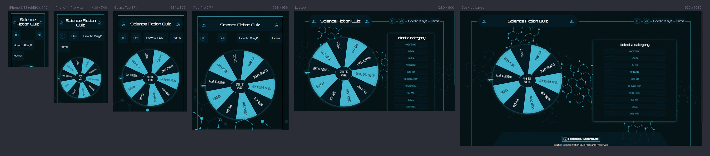

I have also tested the website on real devices such as:
Windows 10 Pro Desktop PC, Windows 10 Pro Laptop, Samsung Galaxy Tab A8, Samsung Galaxy S23 Ultra, Samsung Galaxy S10+, Oppo Find X5, Huawei P30 Pro, iPhone 11 and everything renders as intended and it is 95% responsive.

[Back to Table of Contents](#table-of-contents)

___

### Testing user stories
**Please see the full User Testing Video, after the suer stories below:**

#### Players

User Story 1:
As a player, I want the website to load quickly and provide a seamless and enjoyable quiz experience without any technical issues.

| **Feature** | **Action** | **Expected Result** | **Actual Result** |
|-------------|------------|---------------------|-------------------|
| Website Load | Player opens the website | The website loads quickly and provides a seamless and enjoyable quiz experience | Works as expected |

User Story 2:
As a player, I want to have a visually appealing and intuitive interface that makes it easy for me to understand and interact with the quiz.

| **Feature** | **Action** | **Expected Result** | **Actual Result** |
|-------------|------------|---------------------|-------------------|
| Visual Appeal	| Player views the interface | The interface is visually appealing and intuitive, making it easy to understand and interact with the quiz | Works as expected |

User Story 3:

As a player, I want to be able to select a specific category, such as "Game of Thrones" or "Star Wars," to play a quiz tailored to my interests.

| **Feature** | **Action** | **Expected Result** | **Actual Result** |
|-------------|------------|---------------------|-------------------|
| Category Selection | Player chooses a specific category | The player can select a category, such as "Game of Thrones" or "Star Wars," and play a quiz tailored to their interests	| Works as expected |

User Story 4:

As a player, when I navigate to different game categories, I want the category theme to be a seamless transition to match the new category, creating a smooth and cohesive environment. This includes category-themed background images and background music.

| **Feature** | **Action** | **Expected Result** | **Actual Result** |
|-------------|------------|---------------------|-------------------|
| Category Transition | Player navigates to different game categories | The category transition is seamless, matching the new category with appropriate background images and background music | Works as expected |

User Story 5:

As a player, I want the quiz questions to be challenging and engaging, providing a variety of question types and difficulty levels.

| **Feature** | **Action** | **Expected Result** | **Actual Result** |
|-------------|------------|---------------------|-------------------|
| Challenging Questions | Player answers quiz questions | The quiz questions are challenging and engaging, with a variety of question types and difficulty levels | Works as expected |

User Story 6:

As a player, I want to see my score and the number of correct answers at the end of the quiz to assess my performance.

| **Feature** | **Action** | **Expected Result** | **Actual Result** |
|-------------|------------|---------------------|-------------------|
| Score Display | Player completes the quiz | The player sees their score and the number of correct answers at the end of the quiz | Works as expected |

User Story 7:

As a player, I want to be able to see the correct answers for the questions I answered incorrectly to learn and improve my knowledge.

| **Feature** | **Action** | **Expected Result** | **Actual Result** |
|-------------|------------|---------------------|-------------------|
| Incorrect Answers Feedback | Player completes the quiz | The player can view the correct answers for the questions they answered incorrectly, allowing them to learn and improve their knowledge | Works as expected |

User Story 8:

As a quiz player, I want the option to play the quiz again with the same category or choose a different category to explore different topics.

| **Feature** | **Action** | **Expected Result** | **Actual Result** |
|-------------|------------|---------------------|-------------------|
| Replay Quiz | Player completes a quiz | The player can choose to replay the quiz with the same category or select a different category to explore different topics | Works as expected |

User Story 9:

As a player, I want to be able to easily navigate back to the home page or explore other sections of the website after completing the quiz.

| **Feature** | **Action** | **Expected Result** | **Actual Result** |
|-------------|------------|---------------------|-------------------|
| Navigation Options | Player completes the quiz | The player can easily navigate back to the home page or explore other sections of the website without any hassle | Works as expected |

User Story 10:

As a player, I want the game to have smooth and fluid animations and transitions, enhancing the overall visual appeal and user experience.

| **Feature** | **Action** | **Expected Result** | **Actual Result** |
|-------------|------------|---------------------|-------------------|
| Smooth Animations | Player interacts with various elements in the game | The game features smooth and fluid animations and transitions, enhancing the visual appeal and providing a seamless user experience | Works as expected |

User Story 11:

As a player, I want the game to be optimized for different screen sizes and orientations, ensuring a seamless and enjoyable experience on both mobile and desktop devices.

| **Feature** | **Action** | **Expected Result** | **Actual Result** |
|-------------|------------|---------------------|-------------------|
| Responsive Design | Player accesses the game on different devices | The game is optimized for different screen sizes and orientations, providing a seamless and enjoyable experience on both mobile and desktop devices | Works as expected |

User Story 12:

As a player, I want the game to have a visually appealing and intuitive user interface, with clear icons and labels, to easily understand and interact with the game controls.

| **Feature** | **Action** | **Expected Result** | **Actual Result** |
|-------------|------------|---------------------|-------------------|
| User Interface Design | Player interacts with the game controls | The game has a visually appealing and intuitive user interface with clear icons and labels, making it easy for the player to understand and interact with the controls | Works as expected |

User Story 13:

As a player, when I interact with buttons or elements in the game interface, I want to hear appropriate sound effects, such as button clicks or hover sounds. These sound effects will provide feedback and create a more engaging and responsive user experience.

| **Feature** | **Action** | **Expected Result** | **Actual Result** |
|-------------|------------|---------------------|-------------------|
| Interactive Sound Effects | Player interacts with buttons or elements in the game | The game provides appropriate sound effects, such as button clicks or hover sounds, giving feedback and enhancing the overall user experience | Works as expected |

User Story 14:

As a player, I want the sound effects to be enjoyable, non-intrusive, and harmonize with the overall game aesthetics, ensuring they enhance the gameplay experience without becoming distracting or annoying.

| **Feature** | **Action** | **Expected Result** | **Actual Result** |
|-------------|------------|---------------------|-------------------|
| Pleasant Sound Effects | Player experiences sound effects during gameplay | The sound effects in the game are enjoyable, non-intrusive, and complement the overall game aesthetics, enhancing the gameplay experience without being distracting or annoying | Works as expected |

User Story 15:

As a science fiction enthusiast, I want to be able to play a Science Fiction Quiz to test my knowledge and have fun.

| **Feature** | **Action** | **Expected Result** | **Actual Result** |
|-------------|------------|---------------------|-------------------|
| Science Fiction Quiz | Player selects the Science Fiction category | The player can play a variety of Science Fiction category Quizes that tests their knowledge and provides a fun experience | Works as expected |

User Story 16:

As a player, I want the game to have a progress bar or indicator to track my progress during the quiz.

| **Feature** | **Action** | **Expected Result** | **Actual Result** |
|-------------|------------|---------------------|-------------------|
| Progress Indicator | Player starts a quiz | The game displays a progress bar or indicator that tracks the player's progress during the quiz | Works as expected |

#### Site Owner

User Story 17:

As the site owner, I want to receive feedback from players so I can understand if they are enjoying the game, identify any bugs, and continually improve the game

| **Feature** | **Action** | **Expected Result** | **Actual Result** |
|-------------|------------|---------------------|-------------------|
| Footer Feedback Link | The user scrolls to the footer of any page and clicks the feedback / report bus button | The feedback popup loads and the feedback form is visible | Works as expected |
| Feedback Page Form | The feedback page loads and the player fills out and then submitted the feedback form  | The player fills out the form and submits the form | Works as expected |
| Feedback Form Validation  | The player fills out the form but doesn't fill in all fields or enters an incorrect email format | If required fields are empty or the email address is invalid an error message is shown below the form fields and the form can't be submitted | Works as expected |
| Feedback Page Form Submitted Screen | The player successfully fills out the feedback form and submits the form | The form submits and a thank you screen is shown confirming submission. Form submissions are then emailed via EmailJS to the site owner/developer | Works as expected |

User Story 18:

As the site owner, I want users to see a 404 page if they enter an incorrect URL so they can be navigated back to the main game page

| **Feature** | **Action** | **Expected Result** | **Actual Result** |
|-------------|------------|---------------------|-------------------|
| 404 Page | The player enters an invalid game URL in their browser | A 404 Not Found page with details on how to navigate back to the game is shown | Works as expected |
| 404 Return Home Button | The player enters an invalid game URL in their browser  | The player clicks on the Return Home button on the 404 page and is taken back to the home page to start a new game | Works as expected |

### User Story Video
[Click here to view the full User Story Video](./docs/documentation-images/testing/user-story-testing/Science-Fiction-Quiz-User-Story-Video.mp4)

[Back to Table of Contents](#table-of-contents)

___

## Bugs

| **Bug** | **Fix** |
| --- | --- |
| Bug: Music or Sound Buttons not working, or image changes but sound stays the same. | Solution: Reviewed the event listeners and sound playback functions to ensure they are properly connected. Fixed the code that handles sound playback, ensuring that the correct sound file is played when the button is clicked and that the image and sound stay synchronized. |
| Bug: All sound not being muted on the overlay screen. | Solution: Adjusted the code responsible for muting and unmuting sounds to cover all sound elements present on the overlay screen. Ensured that the mute functionality applies to all sounds consistently. |
| Bug: Overlay screen not showing. | Solution: Identified the code issue that prevented the overlay screen from being displayed. Corrected the code to properly trigger the display of the overlay screen when necessary. |
| Bug: Overlay screen click to enter not working. | Solution: Reviewed the event listeners and click handlers associated with the overlay screen. Fixed the code to properly detect and respond to clicks, allowing users to enter the desired section or continue with the game as intended. |
| Bug: Wheel spin not spinning. | Solution: Investigated the code responsible for the wheel spin animation and rotation. Fixed any errors or inconsistencies, ensuring that the wheel spins smoothly and accurately reflects the selected option. |
| Bug: Wheel Spin upon selection did nothing. | Solution: Analyzed the code that handles the interaction between the wheel spin and the selected option. Corrected any logic issues or missing code, allowing the selected option to trigger the expected actions or transitions. |
| Bug: Popup not working. | Solution: Examined the code associated with the popup functionality, including event listeners and animation triggers. Identified and resolved any code issues that prevented the popup from displaying or functioning as intended. |
| Bug: Popup not closing. | Solution: Inspected the code responsible for closing the popup upon user interaction or completion of a specific action. Fixed any issues that prevented the popup from closing, ensuring that it can be dismissed when needed. |
| Bug: JSON questions not loading. | Solution: Reviewed the code responsible for fetching and parsing JSON data for quiz questions. Identified and fixed any issues related to data retrieval, parsing, or data structure compatibility, ensuring that the questions load successfully. |
| Bug: Next Question button not working. | Solution: Analyzed the code associated with the Next Question button's functionality, including event listeners and navigation logic. Fixed any code issues that prevented the button from advancing to the next question when clicked. |
| Bug: Progress bar not changing. | Solution: Examined the code that updates the progress bar during the quiz. Corrected any issues with calculating or updating the progress bar's value to reflect the player's progress accurately. |
| Bug: Results page being empty, showing no results. | Solution: Investigated the code responsible for populating and displaying the results page. Identified and fixed any issues that prevented the proper rendering of results data, ensuring that the results page shows the relevant information. |
| Bug: Feedback form not submitting. | Solution: Reviewed the code associated with the feedback form, including form validation and submission handling. Fixed any issues that prevented the form from being submitted successfully, allowing users to provide feedback as intended. |
| Bug: Image links missing "." before the "/". | Solution: Scanned the codebase to identify missing periods (".") before the forward slashes ("/") in image URLs. Added the missing periods to ensure the image links point to the correct locations. |
| Bug: "play() failed because the user didn't interact with the document first" error. | Solution: Updated the code that triggers sound playback to address the error and ensure sound can be played without requiring prior user interaction with the document. |

[Back to Table of Contents](#table-of-contents)

___

## Deployment

The website was deployed using GitHub Pages by following these steps:

The Live link is [Science Fiction Quiz.](https://devancadman.github.io/MP2-Science-Fiction-Quiz/)

#### To deploy the project:
1. In the [GitHub repository](https://github.com/), navigate to the *Settings* tab.
2. Once in Settings, navigate to the *Pages* tab on the left hand side.
3. In the *Build and deployment* section under *Branch*, select the **master** branch and click *Save*.
4. Once the master branch has been selected, the page will be automatically refreshed and a display indicates the successful deployment and the link to the address.

#### To run the website on a local machine:
1. Go to the [MP2 Science Fiction Quiz Website repo](https://github.com/devancadman/MP2-Science-Fiction-Quiz)
2. Click on the green *Code* button and *Download ZIP*
3. Extract the ZIP file on your local machine
4. Run the *index.html* file in a browser

#### To clone the repo:
1. Go to the [MP2 Science Fiction Quiz Website repo](https://github.com/devancadman/MP2-Science-Fiction-Quiz)
2. Click the *Code* button to the right of the screen and copy the *HTTPs* link there
3. Open a GitBash terminal and navigate to the directory where you want to locate the clone
4. Type `git clone` and paste the copied *HTTPs* link, press the *Enter* key to begin the clone process

[Back to Table of Contents](#table-of-contents)

___

## Credits

Images not referenced below are owned or created by the developer.

___

## Credits

* My Theme including buttons was inspired by this vector futuristic HUD element on [Adobe Stock](https://stock.adobe.com/uk/images/id/533211466?get_facets=1&order=relevance&safe_search=1&k=sci+fi+ui%2C+futuristic+hud%2C+futuristic+ui&filters%5Bcontent_type%3Azip_vector%5D=1&filters%5Bcontent_type%3Aphoto%5D=1&clickref=1101lwQ5S5AB&mv=affiliate&mv2=Freepik&as_camptype=&as_channel=affiliate&as_source=partnerize&as_campaign=Freepik&as_content=api&as_audience=idp&sdid=6WTV6YJ5)

### Code
 All my code was written based on what I have learned from [CodeInstitute Full Stack Developer Course](https://codeinstitute.net/ie/full-stack-software-development-diploma/) and [W3schools](https://www.w3schools.com/) and other online resources.
 * CSS Reset was added to the site from [Josh's Custom CSS Reset](https://www.joshwcomeau.com/css/custom-css-reset/).
 * CSS [Grid](https://css-tricks.com/snippets/css/complete-guide-grid/) & [Flex](https://css-tricks.com/snippets/css/a-guide-to-flexbox/) was based on what I have learned from [CSS-Tricks](https://css-tricks.com/).
 * Help was taken from [StackOverflow](https://stackoverflow.com/)
 *  [ChatGPT by OpenAI - for code validation, formatting, & content suggestions](https://chat.openai.com/)
 * Spin the Wheel inspiration was taken from this [Codepen](https://codepen.io/sumeshkp18/pen/VGBPYg?editors=0010)
 * Inspiration for the Audio on Hover was found [here](https://codepen.io/abirana/pen/GdzQRb)

### Icon References/Attributes
* Favicon- [Vecteezy icon link](https://www.vecteezy.com/vector-art/693919-hud-interface-elements) - <a href="https://www.vecteezy.com/free-vector/hud">Hud Vectors by Vecteezy</a>
* Cursor Icon - [Freepik icon link](https://www.freepik.com/premium-vector/hud-arrows-hologram-scifi-arrow-futuristic-light-triangle-pointers-digital-directional-movement-cursor-neon-cyberpunk-game-ui-orientation-symbol-garish-vector-illustration_41552367.htm#page=8&query=future%20cursor&position=8&from_view=search&track=locales)
* Music Icons - [Flaticon icon link](https://www.flaticon.com/free-icon/music_10903776) - <a href="https://www.flaticon.com/free-icons/ui" title="ui icons">Ui icons created by riajulislam - Flaticon</a>
* Mute/Unmute Icons - [Vecteezy icon link](https://www.vecteezy.com/vector-art/7770749-media-player-icons-with-white-background) - <a href="https://www.vecteezy.com/free-vector/media-player">Media Player Vectors by Vecteezy</a>
* Envelope Icon - [Fontawesome](https://fontawesome.com/icons/envelope?f=classic&s=regular)

### Image References/Attributes
* Hacker Theme image, I created using a hexagon molecule structured theme.
* Game of Thrones Background - [wiki](https://commons.wikimedia.org/wiki/File:House_Blackfyre_wallpaper_1920x1080_by_YarroGarm_on_DeviantArt.jpg)
* Scorpion Background - [wiki](https://en.wikipedia.org/wiki/Scorpion_%28TV_series%29#/media/File:Scorpion_intertitle.png)
* Star Trek Background - [wiki](https://en.wikipedia.org/wiki/LCARS#/media/File:Lcars_wallpaper.svg)
* Supernatural Background - [GetWallpapers](https://getwallpapers.com/wallpaper/full/f/a/9/1316851-new-supernatural-wallpaper-1920x1200-full-hd.jpg)
* Doctor Who Tardis Background - [wikia](https://static.wikia.nocookie.net/tardis/images/0/08/Site-background-dark/revision/latest?cb=20230117200146)
* The Big Bang Theory Background - [GetWallpapers](https://getwallpapers.com/wallpaper/full/e/8/9/838146-most-popular-big-bang-theory-wallpapers-1920x1080.jpg)
* Stranger Things Background - [GetWallpapers](https://getwallpapers.com/wallpaper/full/d/c/e/980184-stranger-things-wallpapers-1920x1080-images.jpg)
* Star Wars Background - [GetWallpapers](https://getwallpapers.com/wallpaper/full/4/9/2/636174.jpg)
* Stargate Background - [WallpaperSafari](https://wallpapersafari.com/w/XrRTe8)
* Harry Potter Background - [GetWallpapers](https://getwallpapers.com/wallpaper/full/0/6/b/15711.jpg)

All Images & Icons may have been edited to better reflect the site theme!

### Audio References
* Wheel Spin, spinning sound - [Pixabay](https://pixabay.com/sound-effects/spinner-sound-36693/)
* Home Page artificial intelligence ai themed sound - [Pixabay](https://pixabay.com/music/supernatural-artificial-intelligence-ai-v11-1177/)
* Button Hover sound - [Pixabay](https://pixabay.com/sound-effects/search/hover/)
* All Category/theme audio was taken from youtube and converted to MP3's.

[Back to Table of Contents](#table-of-contents)

___

## Acknowledgements

I would like to thank the following people for their contributions to creating this project:
* My Cohort Facilitator -  [Iris Smok](https://github.com/Iris-Smok) for her help & support.
* My Mentor for continuous helpful feedback.
* Tutor support at Code Institute for their support.
* My course colleagues for helping me with any questions I had.
* Other Course Students helping through the Peer-code-review slack channel.

[Back to Table of Contents](#table-of-contents)